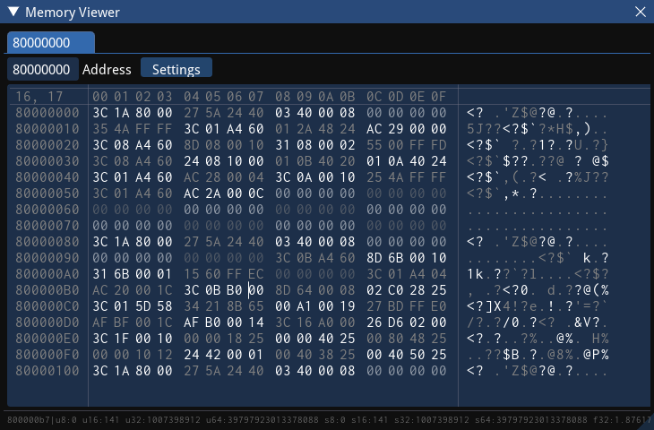
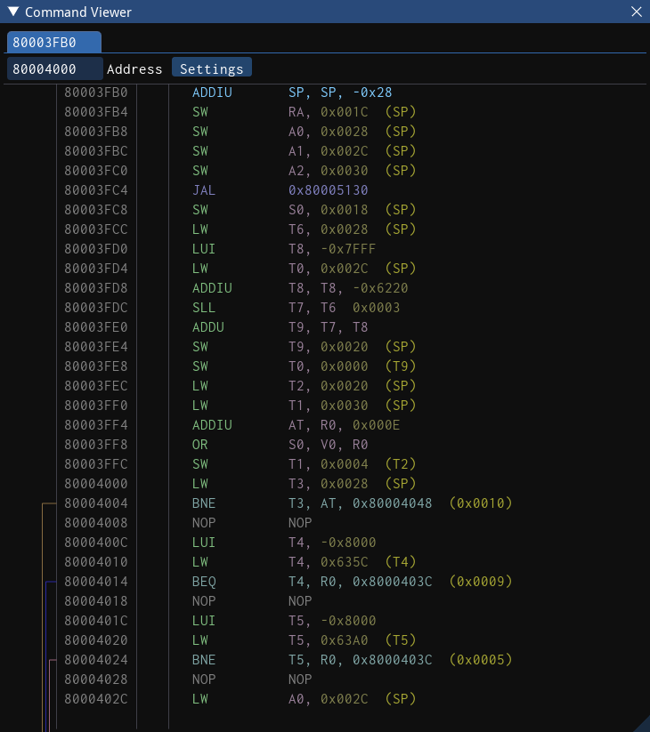

# Memory Utils 3
The third iteration of ModLoader64's debugger suite.

## Features

### Memory Viewer
A customizable, and highly configurable memory viewer, with support for tabs and docking.

### Memory Search
Currently unavailable.

### Command Viewer
A (soon-to-be) customizable, and (soon-to-be) highly configurable command viewer, with support for tabs and docking.
 
Currently supports mips.

### Stylization System
A reasonably modular system which allows the user to load ImGui themes through json files or javascript objects.
